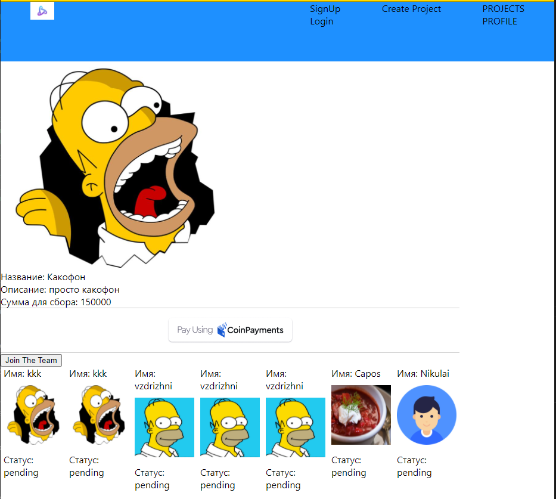

<!--
*** Thanks for checking out this README Template. If you have a suggestion that would
*** make this better, please fork the repo and create a pull request or simply open
*** an issue with the tag "enhancement".
*** Thanks again! Now go create something AMAZING! :D
-->

<!-- PROJECT SHIELDS -->
<!--
*** I'm using markdown "reference style" links for readability.
*** Reference links are enclosed in brackets [ ] instead of parentheses ( ).
*** See the bottom of this document for the declaration of the reference variables
*** for contributors-url, forks-url, etc. This is an optional, concise syntax you may use.
*** https://www.markdownguide.org/basic-syntax/#reference-style-links
-->
<!-- [![Contributors][contributors-shield]][contributors-url]
[![Forks][forks-shield]][forks-url]
[![Stargazers][stars-shield]][stars-url]
[![Issues][issues-shield]][issues-url] -->


<!-- PROJECT LOGO -->
<br />
<p align="center">
  <a href="https://github.com/Danial41/russtarter-front">
  </a>

  <h3 align="center">React --> [Russtarter]</h3>

  <p align="center">
    Приложение для профессионального взаимодействия.
    <br />
    <a href="https://github.com/Danial41/russtarter-front"><strong>Explore the docs »</strong></a>
    <br />
    <br />
    <a href="https://github.com/Danial41/russtarter-front">Report Bug</a>
    ·
    <a href="https://github.com/Danial41/russtarter-front">Request Feature</a>
  </p>
</p>

<!-- TABLE OF CONTENTS -->
## Таблица контента

* [О проекте](#about-the-project)
  * [Сделано с помощью...](#built-with)
  * [Использование](#usage)
* [Лицензия](#license)

<!-- ABOUT THE PROJECT -->
## О проекте
Социальная сеть с рейтингом пользователей на основе источников информации о финансовом состоянии, об экономической деятельности и других источников информации, на примере соц сетей. С возможностью объединения в проекты с целью получения инвестиций или кредитов, или инвестирования и кредитования.



### Ссылка на бэк

[Сервер](https://github.com/Danial41/russtarter-back)

### Сделано с помощью
Этот проект сделан с помощью:
* React
* Redux
* PWA

<!-- INSTALLATION -->
## Использование

Чтобы получить приложение:
* [скачать](https://github.com/Danial41/russtarter-front) или клонировать репозитторий:
  - Клонировать с SSH
  ```
    git@github.com:Danial41/russtarter-front.git
  ```
  - Клонировать с HTTPS
  ```
    https://github.com/Danial41/russtarter-front.git
  ```

* В папке с проектом нужно ввести команды:

  - `$ npm install` - устанавливает зависимости

  - `$ npm start` - запускает приложение в режиме разработки:
    - Откройте [http://localhost:3000](http://localhost:3000).
    - Страница перезагружается автоматически после каждого сохранения.

  - `$ npm build`
    - Собирает все файлы в папку для размещения.

## Демо
Проект размещён на сервисе Netlify.

[Демо - ](https://tender-bose-606bf0.netlify.app/) :point_left:

<!-- CONTACT -->
## Contributors

👤 **Danial41**

## Show your support

Дай звезды если понравилось!

## 📝 Лицензия

This project is [MIT](https://opensource.org/licenses/MIT) licensed.
